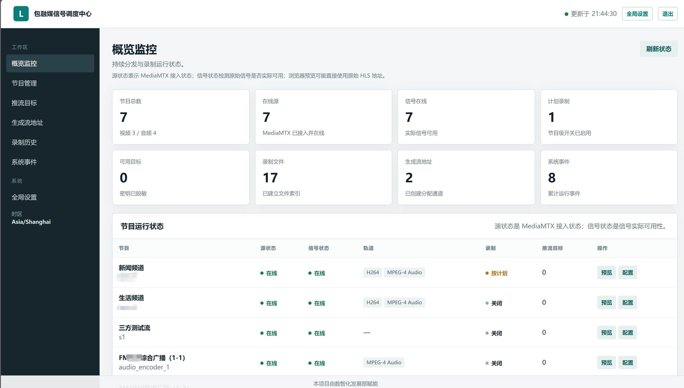

# brmlive



基于 **MediaMTX、FFmpeg 和 Go control-api** 的直播信号调度管理项目，面向多源节目接入、定时录制与多平台分发，支持：

- HLS、UDP/MPEG-TS 和 `publisher://` 节目源
- HLS 输出、fMP4 录制和多个 RTMP/RTMPS 目标分发
- FFmpeg 处理 UDP/MPEG-TS 解复用、MP2 到 AAC 转码、RTMP 原码中继与录制预览生成
- 节目、推流目标、第三方流地址、录制计划和录制文件管理
- MediaMTX 状态同步、断流恢复、目标中继和事件记录
- 可选的同 VLAN UDP 多节目（MPTS）音频拆分

本仓库只包含通用代码、示例配置和部署模板。真实源地址、域名、账号、密码、Stream Key、证书、数据库和服务器路径必须通过未提交的 `.env`、密钥管理系统或部署平台注入。

## 快速开始

```powershell
Copy-Item .env.example .env
docker compose pull
docker compose up -d --build
docker compose ps
```

首次启动使用 `.env` 中配置的管理员账号；请立即修改 `ADMIN_PASSWORD` 和 `STREAM_KEY_ENCRYPTION_KEY`，不要使用示例值。默认服务端口：

| 端口 | 用途 |
| ---: | --- |
| 8080 | control-api 和管理控制台 |
| 8888 | MediaMTX HLS |
| 1935 | MediaMTX RTMP |
| 19997 | MediaMTX Control API（仅本机） |
| 19998 | MediaMTX Metrics（仅本机） |

## 本地验证

```powershell
./scripts/verify.ps1
./scripts/verify.ps1 -EnableRecording
Set-Location control-api; go test ./...
```

本地示例播放地址为 `http://localhost:8888/test_video/index.m3u8`，控制台为 `http://localhost:8080/`。公开测试源可能自然结束，不能代替真实源的长期稳定性测试。

第三方流地址创建后，control-api 可生成独立的 RTMP 推流、RTMP 拉流和 HLS（`.m3u8`）拉流地址。对外部署时，将 `PUBLIC_RTMP_BASE_URL`、`PUBLIC_HLS_BASE_URL` 设置为实际域名，并在边界防火墙或 Nginx stream 中单独转发 TCP 1935；不要把 MediaMTX Control API 或 Metrics 暴露到公网。

## UDP 音频

同 VLAN 的 MPEG-TS 组播应在 Linux `network_mode: host` 容器中接收。`udp-splitter` 可按 program number 拆分 MPTS、转为 AAC 并以 RTMP publisher 写入 MediaMTX；也支持单路 UDP 输入。请基于 `udp-splitter/config.example.json` 创建本地 `config.json`，并通过未提交的本地配置填写组播地址、网卡地址和节目映射。

## 安全与提交前检查

```powershell
git diff --check
gitleaks detect --no-banner
```

不要提交 `.env`、数据库、录制文件、日志、证书或任何私有部署资料。若凭据曾经进入 Git 历史，应先轮换凭据，再使用专门的历史清理流程处理历史提交。

## 停止

```powershell
docker compose down
```

录制文件和日志使用 bind mount，停止容器不会删除 `data/` 中的数据。
